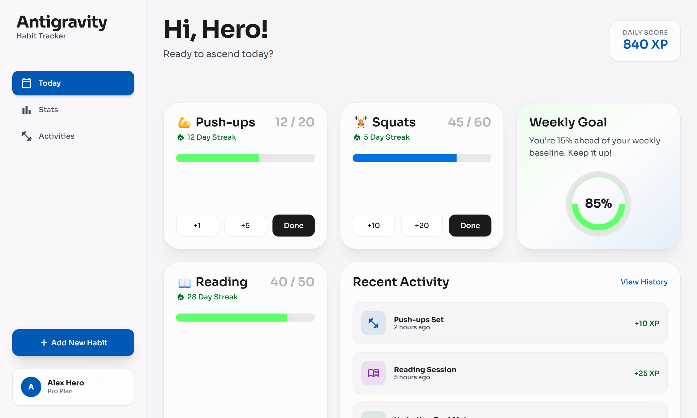
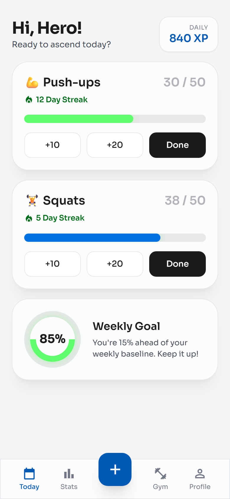

<div align="center">

# 🏆 Habit Tracker

**A PWA for tracking daily habits and workouts**
Numeric and simple habits, streaks, calendar, Gym Mode and push reminders — on Cloudflare Workers + D1.

[](LICENSE)
[](https://workers.cloudflare.com/)
[](https://developers.cloudflare.com/d1/)
[](public/manifest.json)
[](tests/)

**🌐 Live:** [sport.ms-cert.workers.dev](https://sport.ms-cert.workers.dev)

</div>

> Deployed manually via `npm run deploy` — there is no Git auto-deploy.

---

## 📸 Screenshots

<div align="center">

| Desktop | Mobile |
|:---:|:---:|
|  |  |

</div>

---

## ✨ Features

- **Two habit types** — numeric (push-ups, pages, km) and simple (check / uncheck)
- **Daily dashboard** with progress bars and streaks
- **Quick add** — +1, +5, +10 buttons, etc.
- **Calendar** with monthly completion view
- **Stats** with 7 / 30-day charts
- **Gym Mode** — log workouts (exercise, weight, reps) + tonnage analytics and top-3 exercises
- **Themes & languages** — light / dark, English and Russian
- **Push notifications** at 8:00, 13:00 and 20:00 Almaty time (only if some habit is still incomplete)
- **Authentication** — email/password or Google OAuth

---

## 🧱 Stack

| Layer | Technology |
|---|---|
| Hosting | Cloudflare Workers |
| Database | Cloudflare D1 (SQLite) |
| Frontend | Vanilla JS SPA, Tailwind CSS |
| Push notifications | Web Push API (RFC 8291), VAPID (RFC 8292) |
| Authentication | PBKDF2-SHA256, signed cookie, Google OAuth |
| Protection | Cloudflare Turnstile, rate limiting |

---

## 📁 Project structure

```
.
├── _worker.js              # backend: API, auth, push, cron
├── public/                 # frontend (no build step)
│   ├── index.html          #   SPA shell
│   ├── app.js              #   the whole frontend (State → API → Render)
│   ├── sw.js               #   Service Worker (receives push notifications)
│   ├── style.css           #   styles (Tailwind + CSS theme variables)
│   └── manifest.json       #   PWA manifest
├── schema.sql              # D1 schema (users, activities, logs, exercises, …)
├── wrangler.jsonc          # Cloudflare Workers config (name, D1, cron)
├── scripts/                # one-off utilities
│   └── generate-vapid-keys.js
├── docs/                   # architecture & feature docs
│   ├── implementation_plan.md
│   └── gym-analytics.md
└── tests/                  # E2E & a11y tests (Playwright + Axe-core)
```

---

## 📚 Documentation

| Document | About |
|---|---|
| [docs/implementation_plan.md](docs/implementation_plan.md) | UI/UX concept and frontend architecture: screens, activity drill-down, achievements |
| [docs/gym-analytics.md](docs/gym-analytics.md) | Gym Mode: DB schema, workout API (`/api/workouts*`), dashboards and BI-ready structure |
| [AGENTS.md](AGENTS.md) | Repository conventions and rules for AI agents |
| [tests/README.md](tests/README.md) | Running E2E & a11y tests |

---

## 🚀 Getting started: from zero to production

### 1. Dependencies

```bash
npm install
```

### 2. Local environment variables

```bash
cp .dev.vars.example .dev.vars
# Fill in SESSION_SECRET and VAPID_* (keys — see step 4)
```

### 3. Database migration

First run, or after changes to `schema.sql`:

```bash
npm run db:init:local                                     # local (for wrangler dev)
wrangler d1 execute trecker --remote --file=./schema.sql  # production
```

### 4. VAPID keys for push (one time)

```bash
node scripts/generate-vapid-keys.js
```

The script prints a key pair — set them as secrets in Cloudflare:

```bash
echo "PUBLIC_KEY"                 | wrangler secret put VAPID_PUBLIC_KEY
echo "PRIVATE_KEY"                | wrangler secret put VAPID_PRIVATE_KEY
echo "mailto:you@example.com"     | wrangler secret put VAPID_EMAIL
echo "long-random-string"         | wrangler secret put SESSION_SECRET
```

### 5. Local development

```bash
npm run dev   # http://localhost:8787
```

### 6. Deploy

```bash
npm run deploy
```

After deploying, the console should show:

```
Deployed sport triggers
  https://sport.ms-cert.workers.dev
  schedule: 0 3 * * *    ← 8:00 Almaty
  schedule: 0 8 * * *    ← 13:00 Almaty
  schedule: 0 15 * * *   ← 20:00 Almaty
```

---

## 🔔 Push notifications

Sent **only if at least one habit for the day is still incomplete**.

| Time (Almaty) | UTC | Title | Body |
|---|---|---|---|
| 8:00 | 03:00 | 🌅 Good morning, hero! | Start the day — check off your first habits! |
| 13:00 | 08:00 | 💪 Lunchtime, hero! | Habits won't check themselves off 😄 |
| 20:00 | 15:00 | 🌙 Good evening, hero! | Last chance to close the day at 100%! |

To subscribe on mobile: **Profile → Notifications → Enable**.

---

## ⚙️ Environment variables

| Variable | Where to set | Description |
|---|---|---|
| `SESSION_SECRET` | `wrangler secret` | Secret for signing session cookies **(required)** |
| `VAPID_PUBLIC_KEY` | `wrangler secret` | Public VAPID key (P-256, base64url) |
| `VAPID_PRIVATE_KEY` | `wrangler secret` | Private VAPID key |
| `VAPID_EMAIL` | `wrangler secret` | Contact email for VAPID |
| `GOOGLE_CLIENT_ID` | `wrangler secret` | Google OAuth (optional) |
| `GOOGLE_CLIENT_SECRET` | `wrangler secret` | Google OAuth (optional) |
| `TURNSTILE_SITEKEY` | `wrangler secret` | Cloudflare Turnstile (optional) |
| `TURNSTILE_SECRET` | `wrangler secret` | Cloudflare Turnstile (optional) |
| `E2E` | `.dev.vars` | `1` disables rate limiting for local E2E tests (do not set in production) |

> 🔒 Secrets are set only via `wrangler secret put` or the Cloudflare dashboard — they never go into the repo. Locally they live in `.dev.vars` (which is in `.gitignore`).

---

## 📄 License

[MIT](LICENSE) © [Aziz](https://github.com/aznrz)
